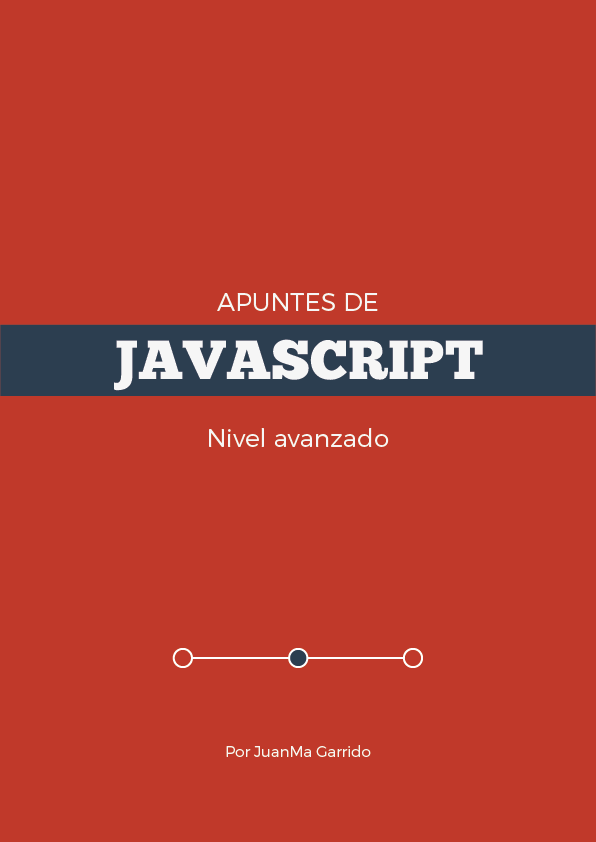

# Apuntes de Javascript II - Nivel Avanzado#

## Descripción ##

Este repositorio contiene la **segunda parte** de los materiales que he ido realizando para diferentes trainings JAVASCRIPT impartidos desde 2010.

Esta segunda parte abarca conceptos más avanzados de Javascript incluyen:

- problemas en conexiones a servidores y soluciones (Same-Origin Policy, JSONP, CORS)
- javascript a fondo (scope, valor de this, prototype, contexto de ejecución)
- javascript "orientado a objetos" (prototype, herencia)
- cómo estructurar mejor tu codigo JS ( patrones de diseño y de codigo)
- cómo testear tu codigo js (unit testings)

Los conceptos cubiertos en este libro te permitiran que tu código JS sea orientado a objetos, testado, escalable y más organizado. 

## Contenidos ##

Este material cubre los siguientes contenidos:

- [Same-Origin Policy](markdown/same_origin_policy)
    -  [JSONP](markdown/same_origin_policy/JSONP)
    -  [CORS](markdown/same_origin_policy/CORS)
- [El valor de `this`](markdown/this)
- [Prototype](markdown/prototype)
- [Herencia](markdown/herencia)
- [Contexto de Ejecución (Function Declaration, Function Expression, Hoisting)](markdown/contexto_ejecucion)
- [Scope](markdown/scope)
- [Patrones de Código](markdown/patrones_codigo)
- [Patrones de Diseño](markdown/patrones_diseno)
- [Unit Testings](markdown/unit_testings)

## Libro ##

Si quieres acceder a este contenido en formato PDF, EPUB o MOBI puedes adquirir el libro por un precio simbolico desde [aqui](https://leanpub.com/apuntes-javascript-avanzado/)

## Referencias ##

Ademas de los enlaces reflejados en los documentos, este material está ampliamente basado en los siguientes libros:

- [JavaScript: The Good Parts](http://www.amazon.com/dp/0596517742) by [Douglas Crockford](http://www.crockford.com/)
- [Object-Oriented JavaScript](http://www.amazon.com/dp/1847194141) by [Stoyan Stefanov](https://twitter.com/stoyanstefanov)
- [JavaScript Patterns](http://www.amazon.com/dp/0596806752) by [Stoyan Stefanov](https://twitter.com/stoyanstefanov)

## Utilizar este material ##

Eres libre de usar este material de acuerdo a los terminos de la [licencia]
(http://creativecommons.org/licenses/by-sa/3.0/deed.es_ES). Si utilizas este material
para alguna formación, me encantaría saberlo (<mailto:JuanMa.Garrido@gmail.com>)

## Copyright & Licencia ##

Este material está sujeto a la licencia [Reconocimiento 3.0 Unported (CC BY 3.0) de Creative Commons](http://creativecommons.org/licenses/by-sa/3.0/deed.es_ES). Puedes copiar, distribuir, comunicar públicamente y modificar el material siempre que atribuyas a Juan Manuel Garrido la autoría original y hagas referencia a [este repositorio](https://github.com/juanmaguitar/training-frontend-docs). Si modificas o creas a partir de este material, puedes distribuir el trabajo resultante solo bajo la misma licencia u otra compatible. Alguna de estas condiciones puede no aplicarse si obtienes el permiso del titular de los derechos de autor.  Al reutilizar o distribuir la obra, tienes que dejar bien claro los términos de la licencia de esta obra. La mejor manera de hacer esto es con un enlace a la licencia [Reconocimiento 3.0 Unported (CC BY 3.0) de Creative Commons](http://creativecommons.org/licenses/by-sa/3.0/deed.es_ES).

Copyright &copy;2012 Juan Manuel Garrido

